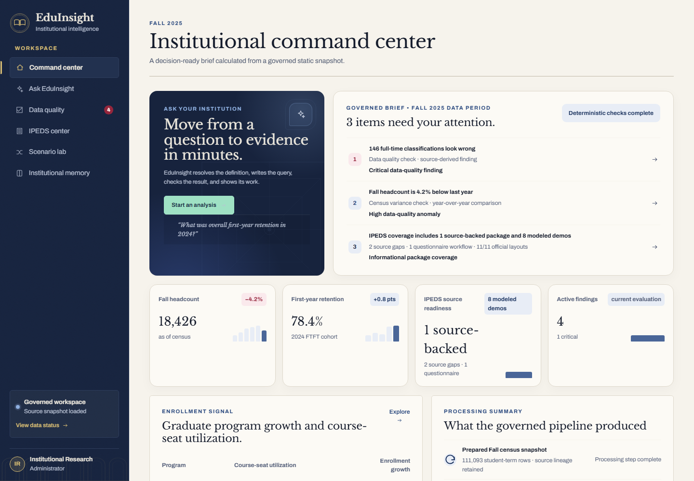
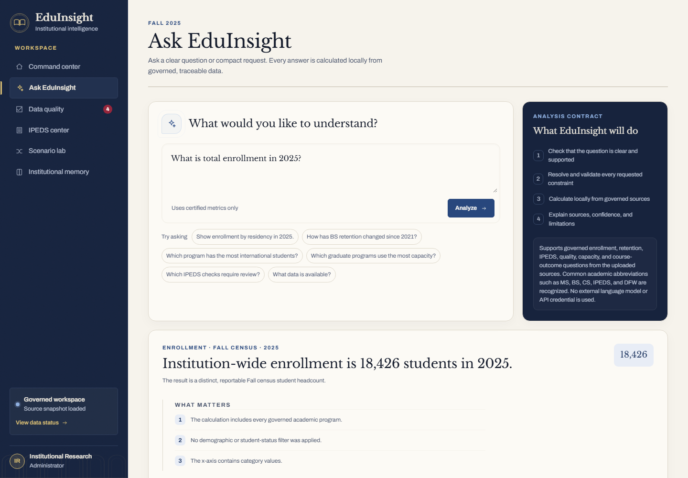
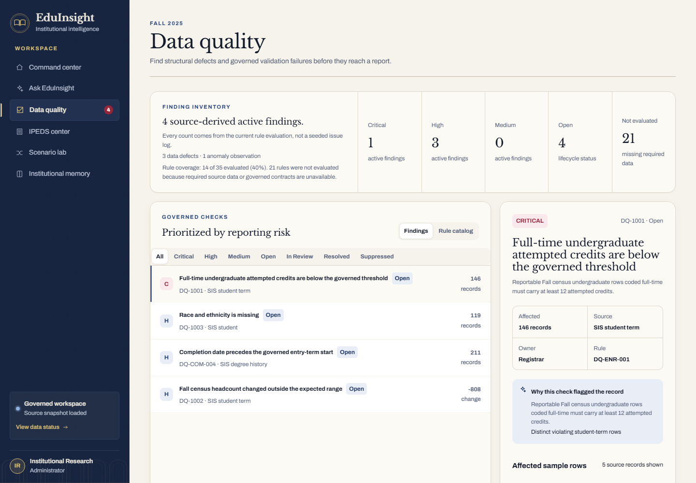
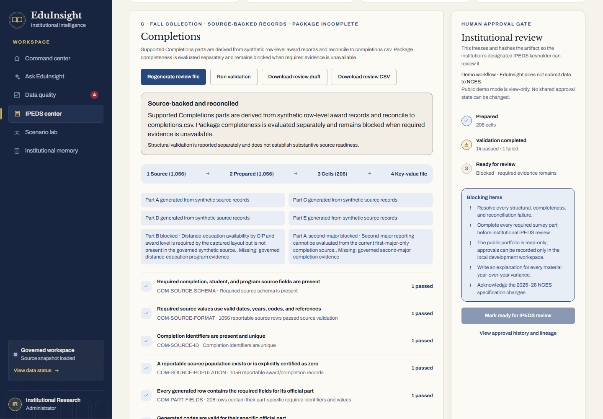
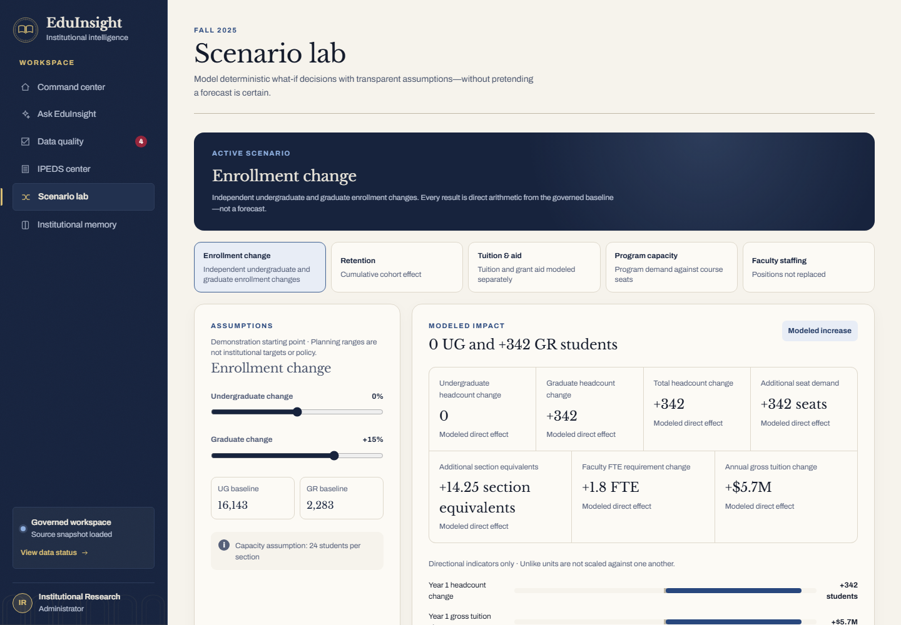
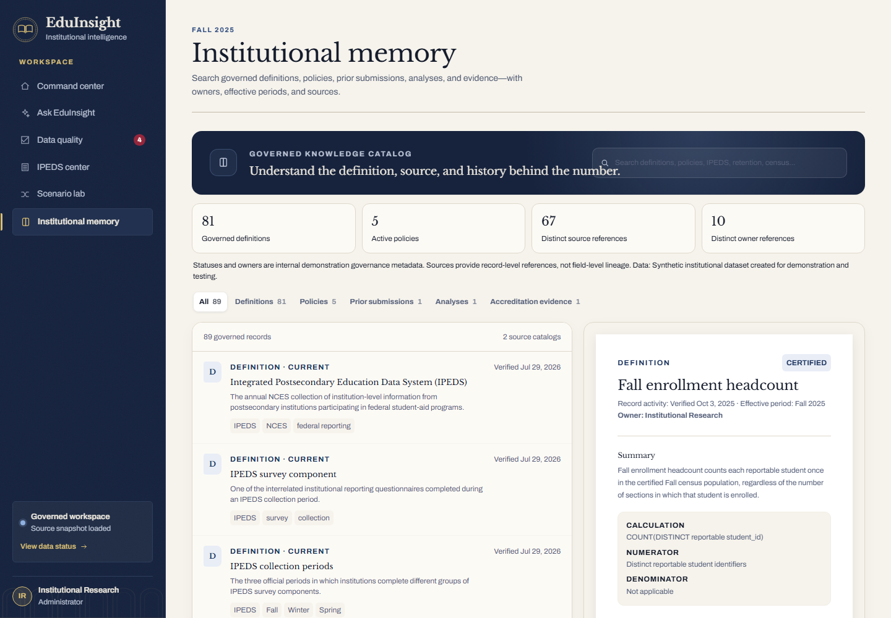

# EduInsight

**Governed institutional intelligence for higher education.**

EduInsight is a synthetic higher-education platform that brings enrollment and
student-success analytics, data-quality workflows, IPEDS preparation, scenario
planning, and institutional definitions into one governed experience. It pairs
deterministic natural-language analysis with source-aware calculations,
validation, and traceable institutional knowledge.

**[Open the live demo →](https://eduinsight-ai.eduinsight-demo.workers.dev)**

*Synthetic higher-education data · Public demo is read-only*



## What it does

### Command Center

An institution-wide snapshot of enrollment, retention, Data Quality, IPEDS
coverage, and program signals, assembled from the current governed data
snapshot.

### Ask EduInsight

A deterministic natural-language interface for institutional analytics. It
resolves governed definitions and constraints, preserves requested filters,
refuses privacy-sensitive requests, and shows calculation provenance—without
calling an external LLM API.

### Data Quality

Source-derived validation with PASS, FAIL, and NOT_EVALUATED outcomes, affected
record evidence, lifecycle review, notes, recurrence handling, and append-only
audit history.

### IPEDS Center

IPEDS preparation support for source readiness, package generation, structural
validation, reconciliation, institutional explanations, and human review. It
clearly separates source-backed work from modeled demonstrations and source
gaps; EduInsight does not submit data to NCES.

### Scenario Lab

Deterministic what-if analysis for enrollment mix, retention, tuition and aid,
program capacity, and faculty staffing. Results are planning sensitivities, not
forecasts or predictions.

### Institutional Memory

A governed, searchable catalog of definitions, policies, sources, owners,
prior submissions, analyses, and accreditation evidence, with explainable
direct and related-term search.

## Inside EduInsight

### Command Center

A governed institutional overview brings current KPIs, reporting risks, and
cross-module signals into one decision-ready brief.


### Ask EduInsight

A plain-English enrollment question resolves to a deterministic answer with
the governed population and calculation context kept visible.



### Data Quality

Source-derived findings connect rule severity and affected counts to evidence,
ownership, and a read-only public review state.



### IPEDS Center

The Completions workflow separates source reconciliation and structural
validation from the missing evidence that blocks institutional review.



### Scenario Lab

A transparent enrollment-change scenario shows its governed baseline,
adjustable assumptions, and deterministic Year 1 effects.



### Institutional Memory

The knowledge catalog pairs searchable institutional definitions with owners,
effective dates, formulas, and source context.



## Architecture

```text
Synthetic governed CSV/JSON source package
  → schema, identity, and reconciliation checks
  → deterministic transformations and metric contracts
  → generated analytical artifacts
  → Next.js / React application modules
       ↳ Cloudflare D1: review lifecycle and approval ledgers
       ↳ Cloudflare R2: approved review artifacts
  → Cloudflare Worker and static assets
```

Ask EduInsight follows a separate fail-closed analytical path:

```text
Question
  → local intent and question-quality checks
  → governed entity, filter, and time resolution
  → strict query-plan validation and constraint reconciliation
  → deterministic calculation
  → sourced answer, clarification, limitation, or privacy refusal
```

No external language model, OpenAI API, API key, token service, or autonomous
agent participates in the answer path. Persistent workflow state belongs in D1;
the governed analytical sources and generated artifacts do not.

### Technical stack

- Next.js 16 and React 19
- TypeScript 5.9 and deterministic JavaScript/ESM analytics
- Vinext on Vite 8 for the Next-compatible Cloudflare build
- Cloudflare Workers, D1, and R2
- Drizzle ORM for durable workflow tables and migrations
- Governed CSV/JSON source contracts and generated analytical artifacts
- Automated release verification across modules and cross-module reconciliation

## Why this project is different

- **Definitions travel with metrics.** A result includes the governed meaning,
  population, filters, source fields, and limitations behind the number.
- **Natural language does not bypass governance.** Ask conserves every detected
  constraint and fails closed when a request cannot be represented safely.
- **Data quality is operational.** Findings retain reviewer state and notes,
  reopen explicitly on recurrence, and write immutable lifecycle events.
- **IPEDS readiness is not reduced to a score.** Structural completeness and
  substantive source readiness are separate, visible concepts.
- **Scenarios are honest what-if calculations.** Inputs produce repeatable
  arithmetic without predictive or causal claims.
- **The hosted portfolio is intentionally read-only.** Public visitors can
  explore governed behavior without changing lifecycle or approval state.

## Engineering highlights

- 89 Institutional Memory records, including 81 governed definitions
- 35 Data Quality rules with 4 current source-derived findings
- Append-only Data Quality lifecycle audit history with recurrence handling
- IPEDS coverage classified as 1 source-backed package, 8 modeled demos,
  2 source gaps, and 1 questionnaire workflow
- Public mutation guards for Data Quality review state and IPEDS approvals
- Deterministic generation, source reconciliation, and dataset-isolation checks
- 600+ automated release checks across analytics, persistence, validation,
  accessibility contracts, public read-only behavior, and cross-module results
- Public Cloudflare Worker deployment backed by dedicated D1 and R2 resources

Representative governed values in the current synthetic snapshot include:

| Metric | Current value |
| --- | ---: |
| Fall 2025 census enrollment | 18,426 |
| 2024 first-time, full-time retention | 78.4% |
| 2025 completion award records | 1,056 |
| Active Data Quality findings | 4 |

## Data and trust boundary

> EduInsight uses synthetic higher-education data created for portfolio
> demonstration and testing.
>
> All records in this prototype are synthetic. No FERPA-regulated or institution-owned data is included. The hosted public demo is read-only.

The public deployment permits analytical reads and client-side exploration but
rejects Data Quality lifecycle changes and IPEDS approval mutations. Trusted
local development can exercise those workflows against local or explicitly
configured development storage.

The current IPEDS work is preparation and review support, not federal
submission. Completions is source-backed for its supported generated parts, but
the complete package remains blocked because per-CIP distance-education and
second-major evidence are unavailable. Modeled-demo packages demonstrate file
construction and validation; source-gap packages remain explicitly incomplete.

## Project structure

| Path | Purpose |
| --- | --- |
| `app/` | Next.js interface, API routes, styles, and generated app artifacts |
| `lib/` | Deterministic Ask, Data Quality, IPEDS, Memory, and Scenario contracts |
| `data/` | Synthetic upload package, IPEDS specifications, and processed outputs |
| `scripts/` | Synthetic generation, ingestion, reconciliation, and release reporting |
| `tests/` | Module, cross-module, privacy, persistence, and release regressions |
| `drizzle/` | Versioned D1 schema migrations |
| `docs/` | Domain audits, deployment guidance, and implementation references |
| `worker/` | Cloudflare Worker integration source |

## Run locally

Requires Node.js 22.13 or later.

```bash
npm ci
npm run dev
```

The development server prints its local URL. Cloudflare credentials are not
required to inspect the application locally.

Build the production Worker bundle:

```bash
npm run build
```

Run the complete release gate:

```bash
npm run verify:release
```

To regenerate the included synthetic dataset and derived artifacts:

```bash
npm run data:refresh
```

## Verification approach

The release gate covers deterministic analytics, source reconciliation,
filter conservation, privacy refusals, unsupported-request handling, Data
Quality lifecycle and audit behavior, IPEDS generation, Scenario calculations,
Institutional Memory integrity, Command Center reconciliation, accessibility
contracts, and public read-only enforcement.

Historical blind-evaluation results remain preserved under `tests/reports/`.
They are retained as engineering evidence rather than presented as current
unseen scores after their cases became regression coverage.

## Documentation

- [Cloudflare deployment](docs/cloudflare-deployment.md)
- [IPEDS 2025–26 implementation](docs/ipeds-2025-26-implementation.md)
- [Data Quality catalog audit](docs/data-quality-catalog-audit.md)
- [Institutional Memory coverage](docs/institutional-memory-coverage.md)
- [Product principles](PRODUCT.md)
- [Design system](DESIGN.md)
- [Technical project dossier](EDUINSIGHT-DOSSIER.md) — detailed architecture,
  design decisions, and preserved evaluation context

## Current limitations

- The dataset and institution are synthetic.
- The public demo is read-only; review-state mutations are local/trusted-workspace
  behavior.
- Ask supports a bounded institutional-data grammar and does not use an external
  LLM.
- Several IPEDS packages are modeled demonstrations or source gaps rather than
  source-backed institutional packages.
- EduInsight prepares and validates review artifacts but does not submit data to
  NCES.
- Scenario Lab provides deterministic what-if analysis, not prediction or
  forecasting.
